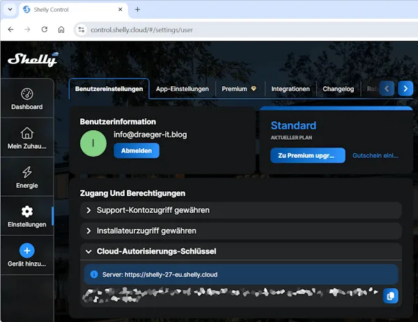

# Shelly RPC API – Postman Collection

Dieses Repository enthält eine strukturierte **Postman Collection für die Shelly RPC API**.  
Die Sammlung soll dabei helfen, die wichtigsten API-Endpunkte von Shelly-Geräten schnell zu testen und besser zu verstehen.

Die Requests sind nach **Funktionsbereichen** organisiert, sodass sich typische Aufgaben wie das Abrufen des Gerätestatus, das Schalten von Relais oder das Auslesen von Sensordaten einfach durchführen lassen.

## Ziel dieses Repositories

Dieses Repository dient als **praktische Referenz und Testumgebung** für die Shelly HTTP RPC API.  
Alle enthaltenen Requests wurden mit realen Geräten getestet und können direkt in Postman importiert werden.

Die Collection eignet sich besonders für:

- Entwickler
- Maker
- Smart-Home Enthusiasten
- IoT-Projekte mit Mikrocontrollern (z. B. ESP32, Raspberry Pi)

## Voraussetzungen

Um die Requests zu nutzen benötigst du:

- ein **Shelly Gerät im Netzwerk**
- die **IP-Adresse des Gerätes**
- das API-Tool **Postman**

Download:  
https://www.postman.com/

Optional kann für Cloud-Zugriffe zusätzlich ein **Shelly Authorization Key** erforderlich sein.

⚠️ **Wichtig**

Der Authorization Key sollte **wie ein Passwort behandelt werden**.  
Auch wenn der Schlüssel in der Shelly Cloud erneut angezeigt werden kann, lässt er sich nicht beliebig neu generieren. Wird er öffentlich bekannt, kann damit auf deine Geräte über die Cloud API zugegriffen werden.

Speichere den Schlüssel daher sicher und teile ihn niemals öffentlich.

